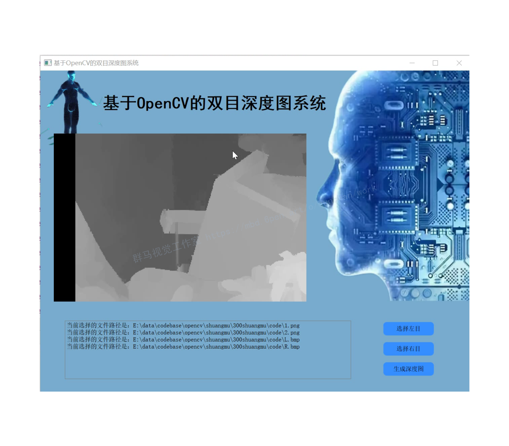
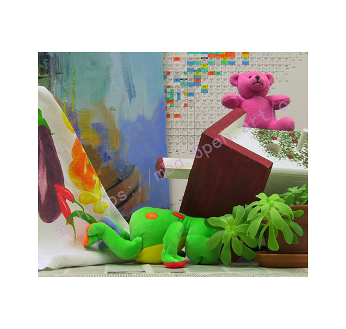
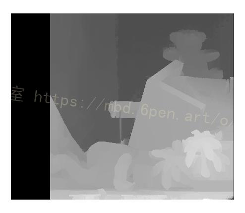

# 1.研究背景
对于双目视觉立体匹配算法，先验的视差范围估计是影响算法匹配效果和运行时间的重要因素。在双目视觉系统的实际应用中，匹配视图之间的视差范围通常随场景的变化而不断改变，因此需要对视图间的视差范围进行有效的自动估计。针对此问题，开发了一种双模相机，可分时采集场景的灰度图像和深度图像，该深度图像与灰度图像有相同的空间分辨力。在双目视图匹配过程中，通过引入深度图的信息，可约束每一个待匹配像素的视差范围。对于实验室内采集的普通视图对，本文方法相较[参考的博客的方法](https://mbd.pub/o/bread/Y5iclJht)视图间视差最大、最小值为约束的方法，匹配速度提高3倍以上，匹配误差减少2%，有效提高了匹配的可靠性和普适性。

# 2.图片展示






# 3.视频演示
[Python基于OpenCV的双目视觉深度图算法（源码＆教程）_哔哩哔哩_bilibili](https://www.bilibili.com/video/BV1UD4y1C7Nt/?vd_source=bc9aec86d164b67a7004b996143742dc)

# 4.视差的概念
是指从两个不同位置观察同一个物体时，此物体在视野中的位置变化与差异。从两个观察点看目标，两条视线之间的夹角叫做这两个点的视差角，两点之间的距离称作视差基线。

#### 为什么单目摄像机不能测深度？
下图从物理原理上展示了为什么单目相机不能测量深度值而双目可以。我们看到红色线条上三个不同远近的黑色的点在下方相机上投影在同一个位置，因此单目相机无法分辨成的像到底是远的那个还是近的那个。

**双目立体视觉深度相机测距流程：**
(1）需要对双目相机进行[标定](https://so.csdn.net/so/search?q=%E6%A0%87%E5%AE%9A&spm=1001.2101.3001.7020)，得到两个相机的内外参数、单应矩阵。
(2) 根据标定结果对原始图像进行校正，校正后的两张图像位于同一平面且互相平行。
(3）对校正后的两张图像进行像素点匹配。
(4）根据匹配结果计算每个像素的深度，从而获得深度图

**理想双目相机成像模型：**
首先我们从理想的情况开始分析：假设左右两个相机位于同一平面（光轴平行），且相机参数（焦距f)一致。那么深度值的推到原理和公式如下：

根据上述推导，空间点p离相机的距离（深度）z=f*b/d，可以发现如果要计算深度z，必须要知道：
(1）相机焦距f，左右相机基线b。这些参数可以通过先验信息或者相机标定得到。
(2）视差b。需要知道左相机的每个像素点（Xl, Yl）和右相机中对应点（Xr，Yr）的对应关系。这是双目视觉的核心问题。
极限约束
那么问题来了，对于左图中的一个像素点，如何确定该点在右图中的位置，可以通过极限约束。
什么是极线呢？如下图所示，C1，C2是两个相机，p是空间中一点，P和两个相机中心点C1、C2形成了三维空间中的一个平面PC1C2，称为极平面。极平面和两幅图像相交于两条直线，这两条直线为极线。p在相机C1中的成像点是P1，在相机C2中的成像点是P2，但p的位置事先是未知的。
我们的目标是：对于左图中的P1点，寻找它在右图中的对应点P2，这样就能确定P点的空间位置，也就是我们想要的空间物体和相机的距离。

所谓极线约束，就是指当同一个空间点在两幅图像上分别成像时，已知左图投影点P1，那么对应右图投影点P2一定在相对于P1的极线上，这样可以极大的缩小匹配范围。


细心的朋友会发现上述过程考虑的情况（两相机共面且光轴平行，参数相同）非常理想，相机C1、C2如果不在同一直线上怎么办？

#### 非理想双目相机成像模型
事实上，这种情况非常常见，因为有些场景下两个相机需要独立固定，很难保证光心C1、C2完全水平，即使是固定在同一基板上也会因为装配的原因导致光心不水平。

我们先来看看这种情况下拍摄的两张左右图片，左图中三个十字标志的点，在右图中对应的极线是右图中的三条白线，也就是对应的搜索区域。我们看到这三条线并不是水平的，如果进行逐点搜索效率非常低。
怎么办呢？
把不理想的转化为理想情况就好了。这就是图像矫正技术。
本文[参考该博客的图像校正技术](https://afdian.net/item?plan_id=1ac62c6c5b1e11edaa2552540025c377)是通过分别对两张图片用单应矩阵变换得到的，目的就是把两个不同方向的图下个平面重新投影到同一平面且光周相互平行，下图中的黄色平面，这样就可以用前面理想情况下的模型了，两个相机的极线也变成水平的了。


# 5.代码实现
```

def depth_map(imgL, imgR, sigma=1.3):
    """ Depth map calculation. Works with SGBM and WLS. Need rectified images, returns depth map ( left to right disparity ) """
    # SGBM Parameters -----------------
    window_size = 3  # wsize default 3; 5; 7 for SGBM reduced size image; 15 for SGBM full size image (1300px and above); 5 Works nicely

    left_matcher = cv2.StereoSGBM_create(
        minDisparity=-1,
        numDisparities=5*16,  # max_disp has to be dividable by 16 f. E. HH 192, 256
        blockSize=window_size,
        P1=8 * 3 * window_size,
        # wsize default 3; 5; 7 for SGBM reduced size image; 15 for SGBM full size image (1300px and above); 5 Works nicely
        P2=32 * 3 * window_size,
        disp12MaxDiff=12,
        uniquenessRatio=10,
        speckleWindowSize=50,
        speckleRange=32,
        preFilterCap=63,
        mode=cv2.STEREO_SGBM_MODE_SGBM_3WAY
    )
    right_matcher = cv2.ximgproc.createRightMatcher(left_matcher) ##Block matching disparity map calculation
    # FILTER Parameters
    lmbda = 80000
    visual_multiplier = 6

    wls_filter = cv2.ximgproc.createDisparityWLSFilter(matcher_left=left_matcher)
    wls_filter.setLambda(lmbda)

    wls_filter.setSigmaColor(sigma)
    displ = left_matcher.compute(imgL, imgR)  # .astype(np.float32)/16
    dispr = right_matcher.compute(imgR, imgL)  # .astype(np.float32)/16
    displ = np.int16(displ)
    dispr = np.int16(dispr)

    return filteredImg
```
# 6.系统整合
此处获取下图[源码＆环境部署视频教程＆自定义UI界面](https://s.xiaocichang.com/s/c58d0e)


# 7.参考文献
[1]Ke Zhang,Jiangbo Lu,Lafruit, G..Cross-Based Local Stereo Matching Using Orthogonal Integral Images[J].IEEE Transactions on Circuits and Systems for Video Technology.2009,19(7).1073-1079.
[2]Yan Huimin,Zhang Xiuda,Jiang Yanbing.Pulse-shape-free method for long-range three-dimensional active imaging with high linear accuracy[J].Optics Letters.2008,33(11).
[3]Zhang, Z..A flexible new technique for camera calibration[J].Pattern Analysis & Machine Intelligence, IEEE Transactions on.2000,22(11).1330-1334.

---
#### 如果您需要更详细的【源码和环境部署教程】，除了通过【系统整合】小节的链接获取之外，还可以通过邮箱以下途径获取:
#### 1.请先在GitHub上为该项目点赞（Star），编辑一封邮件，附上点赞的截图、项目的中文描述概述（About）以及您的用途需求，发送到我们的邮箱
#### sharecode@yeah.net
#### 2.我们收到邮件后会定期根据邮件的接收顺序将【完整源码和环境部署教程】发送到您的邮箱。
#### 【免责声明】本文来源于用户投稿，如果侵犯任何第三方的合法权益，可通过邮箱联系删除。